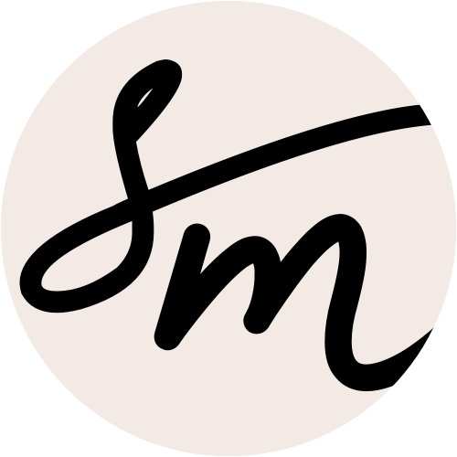

  

# Hi, I'm Silvia 👋

I started my career as web designer and developer, wanting to build intuitive, usable and accessible interfaces.
Gradually, I focused on user experience, bringing my attention from **how** things work to **why**.

My mission is to help creating interactions that serve people best, through careful research and design.

---

🔭 **I’m currently working on**: migrating my website from WordPress to Jekyll.

😄 **Pronouns**: she/her
